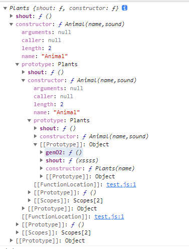
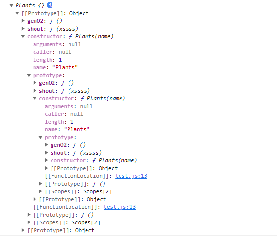

### vue3 中 computed 实现原理
+ 使用effect 函数中lazy属性，使effect为手动调用
+ 使用调度函数 scheduler
  + 只有相关数据发生变化时 scheduler 函数才会执行
  + 执行时将是否为脏数据的flag 设为true
  + 手动触发相关副作用函数trigger()
+ 获取时手动添加追踪函数track()
+ 返回时即返回effect函数执行结果
```js
function computed(getter) {
  // 对值进行缓存处理
  let value = null
  let dirty = true
  const effectFn = effect(getter, {
    lazy: true,
    scheduler() {
      dirty = true
      trigger(obj, "value")
    }
  })
  const obj = {
    get value() {
      if (dirty) {
        value = effectFn()
        dirty = false
      }
      track(obj, "value")
      return value
    }
  }
  return obj
}
```

### watch 实现原理
+ 借助 effect 函数 的 scheduler 和 lazy 选项
+ 传递的数如果是一个响应式数据则对其进行遍历使其每个属性都被追踪
+ oldValue, newValue
  + 若immediate 值为true 则 oldValue 值为undefined
  + immediate 值为false 则手动调用 effectFn() 函数 oldValue就有值
```js
function watch(source, callback, options = {
  immediate: false,
  flush: 'pre'
}) {
  let getter, oldValue, newValue, cleanup
  if (typeof source === 'function') {
    getter = source
  } else {
    getter = () => traverse(source)
  }
  const onInvalidate = (fn) => {
    cleanup = fn
  }
  const job = () => {
    newValue = deepClone(effectFn())
    if (cleanup) {
      cleanup()
    }
    callback(oldValue, newValue, onInvalidate)
    oldValue = newValue
  }
  const effectFn = effect(() => getter(), {
    scheduler: () => {
      if (options.flush === "post") {
        const p = Promise.resolve()
        p.then(job)
      } else {
        job()
      }
    },
    lazy: true
  })
  if (options.immediate) {
    job()
  } else {
    oldValue = deepClone(effectFn())
  }
}
```

### call、apply、bind 区别
+ call、apply 只是参数传递不同，call 接受参数列表， apply接受数组
+ call、apply 只是临时改变this 指向
+ bind 永久改变this指向，需要手动调用触发

### Proxy 拦截的属性
+ deleteProperty 删除对象属性时触发拦截
+ has 对象进行 in 操作是触发

### Reflect.get 第三个参数含义
```js
const obj = { get a() { return this.b; } };
function test() {

}
const proxy = new Proxy(obj, {
  get(target, key) {
    return target[key]
  }
})

console.log(Reflect.get(obj, "a")); // undefined
console.log(Reflect.get(obj, "a", { b: 2 })); // 2
```
### setPrototypeOf 与 Object.create区别
+ Object.create(a,b) 会直接让a prototype 为空然后指向b的prototype，原a身上的prototype将不能访问
+ Object.setPrototypeOf(a,b) a prototype 不变，然后还会指向b的prototype， 优先访问的是a 上的prototype0
```js
function Animal (name,sound) {
  this.name = name
  this.sound = sound
}
Animal.prototype.shout = function () {
  console.log(this.name + this.sound)
}
let dog = new Animal('pipi','wang!wang!')
// 定义Plants
function Plants (name) {
  this.name = name
  this.sound = null
}
// 函数接收参数用于区分
Plants.prototype.shout = function (type) {
  console.log(type  + this.name + this.sound +'plants tag')
}
Plants.prototype.genO2 = function () {
  console.log(this.name + '生成氧气。')
}
// Animal.prototype = Object.create(Plants.prototype)
// console.log(Animal.prototype)
//
// let cat = new Animal('mimi','miao~miao~')
//
// dog.shout() // pipi wang!wang!
// cat.shout("xxxx") // mimi miao~miao~ plants tag
// cat.genO2() // mimi 生成氧气。

Object.setPrototypeOf(Animal.prototype,Plants.prototype)
console.log(Animal.prototype)
let cat = new Animal('mimi','miao~miao~')
dog.shout() // pipi wang!wang!
cat.shout("xxx") // mimi miao~miao~
cat.genO2() // mimi 生成氧气。
```
+ setPrototypeOf

+ Object.create


### shallowReactive 实现原理
+ proxy 中 get 拦截操作时判断 拦截到的是否是对象 默认情况下 如果是对象则在使用proxy进行包装
+ shallowReactive 时 则不对其进行包装 直接返回

### readonly 实现原理
+ proxy 中set 拦截时不进行处理并抛出错误，get操作时如果是对象则使用readonly 再次包裹

### shallowReactive
+ proxy 中set 拦截时不进行处理并抛出错误，get操作时不对对象进行递归包裹

### for of 实现
+ 实现 Symbol.iterator 方法
```js
const arr = [1,2,3]

arr[Symbol.iterator] = function () {
  const target = this
  const len = this.length
  let index = -1
  return {
    next(...args) {
      index++
      return {
        value: index < len ? target[index] : undefined,
        done: index >= len
      }
    }
  }
}
for (const number of arr) {
  console.log(number)
}

```


### set 
+ set集合中 values keys 方法都返回一个迭代器对象
+ 返回内容相同，值不同
```js
const set = new Set([1,2,3])

console.log(set.values()) // 返回一个迭代器对象
console.log(set.keys()) // 返回一个迭代器对象
console.log(set.values() === set.keys()) // false

```
